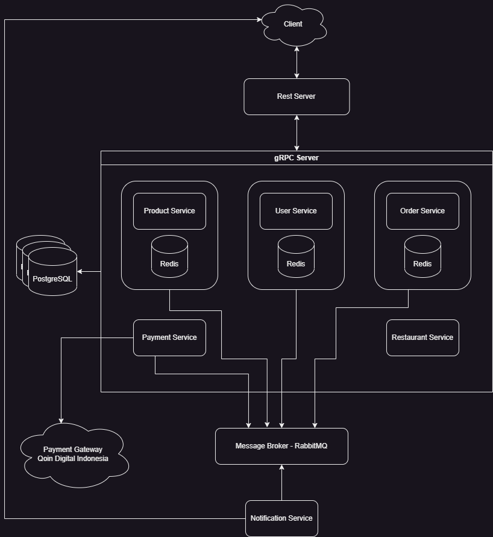
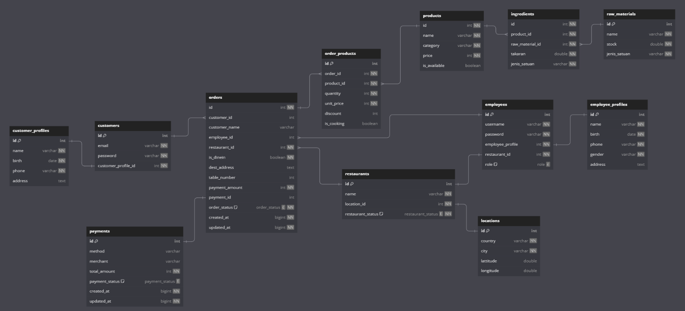

# Aplikasi Rumah Makan

Aplikasi rumah makan ini dirancang untuk meningkatkan efisiensi dan pengalaman pengguna dalam melakukan kegiatan pemesanan, pembayaran, pelaporan, dll. Dengan adanya aplikasi ini dapat membantu pemilik restoran, karyawan, dan pelanggan menjalani pengalaman makan yang lebih baik.

## System Design

## Tech Stack

### Bahasa Pemrograman

Aplikasi ini dibuat dengan menggunakan bahasa pemrograman **Go** pada backend.
Mengapa memilih **Go** ?

- Dikenal karena kinerja yang tinggi dan eksekusi yang cepat dan efisien, yang dimana hal ini penting dalam lingkungan aplikasi restoran yang mungkin harus menangani banyak permintaan secara bersamaan.
- Go memiliki dukungan untuk proses concurrency melalui goroutine dengan manajemen bebori yang efektif, membuatnya ideal untuk aplikasi restoran yang perlu mengelola banyak operasi secara bersamaan, seperti pemrosesan pesanan, pembaruan stok, dan notifikasi real-time
- Dapat menangani beban kerja yang besar dengan efisien
- Memiliki komunitas yang besar dengan banyak resource, dan dukungan online. Sehingga memudahkan developer dalam menemukan solusi atau dukungan ketika menemui masalah.

### Message Broker

Aplikasi ini menggunakan message broker **RabbitMQ** untuk proses asynchronous yang berguna untuk pengiriman notifikasi seperti status order, status payment, promo produk, dll oleh notification service.

### Caching

Aplikasi ini menggunakan redis sebagai in-memory database yang memungkinkan akses data yang cepat dan responsif. Penggunaan redis sangat efektif untuk data yang sering di akses namun jarang berubah, seperti data produk untuk menu pada restoran, user session untuk autentikasi dan autorisasi, dll.

### Payment Gateway

Untuk menghandle pembayaran, aplikasi ini menggunakan 3rd party API - Payment Gateway dari **Qoin Digital Indonesia**. Mengapa **Qoin Digital Indonesia** menjadi pilihan yang tepat untuk aplikasi ini ?

1. Dukungan untuk berbagai metode pembayaran  
   **Qoin Digital Indonesia** mendukung berbagai metode pembayaran, termasuk kartu kredit/debit, visa/master card, bank transfer dan masih banyak metode lainnya sehingga memberikan kenyamanan pada pelanggan dalam menentukan metode pembayaran yang sesuai dengan keinginan pelanggan.
2. Keamanan Transaksi  
   **Qoin Digital Indonesia** memprioritaskan keamanan transaksi dengan menggunakan standar keamanan industri. Ini memberikan rasa aman kepada pelanggan restoran dan mengurangi risiko keamanan transaksi finansial.
3. Integrasi yan mudah  
   **Qoin Digital Indonesia** menyediakan dokumentasi API yang lengkap dan dukungan untuk integrasi yang mudah dengan aplikasi.
4. Kemampuan menangani transaksi dalam skala besar  
   **Qoin Digital Indonesia** dirancang untuk menangani voluume transaksi yang besar, menjadikannya pilihan yang cocok untuk aplikasi restoran yang mungkin mengalami lonjakan pesanan saat waktu-waktu tertentu.
5. Komitmen terhadap inovasi  
   **Qoin Digital Indonesia** terus menerus melakukan inovasi dan pembaruan pada platformnya. Ini dapat memberikan akses pemilik restoran terhadap fitur-fitur terbaru dan teknologi pembayaran yang berkembang.

### Database

Untuk database, aplikasi ini menggunakan **PostgreSQL**. Mengapa memilih PostgreSQL ?

- Mendukung transaksi ACID (Atomicity, Consistency, Isolation, Durability) yang menjadikannya ideal untuk sistem yang memerlukan konsistensi dan reliability.
- Memberikan kinerja yang baik bahkan pada skala besar, dengan dukungan untuk indeks yang efisien, optimalisasi query dan fitur otomatisasi.
- Lisensi open source

#### Diagram Database

Untuk melihat lebih detail diagram database, bisa dengan mengakses file PDF di **./assest/db_schema.pdf** atau bisa kunjungi ke link: [https://dbdocs.io/osvaldosilitonga/PT-Qoin-Digital-Indonesia](https://dbdocs.io/osvaldosilitonga/PT-Qoin-Digital-Indonesia?view=relationships)

